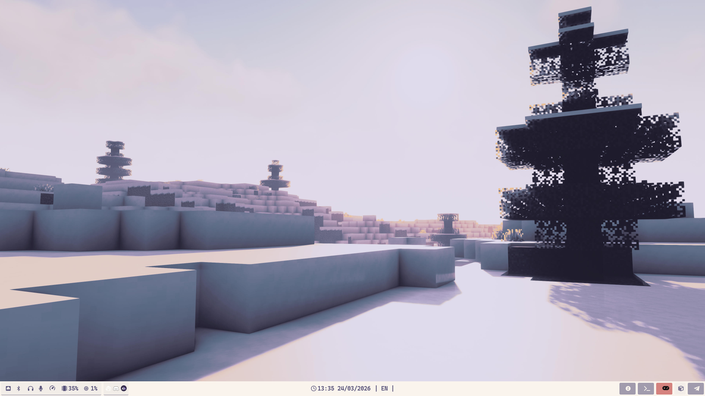
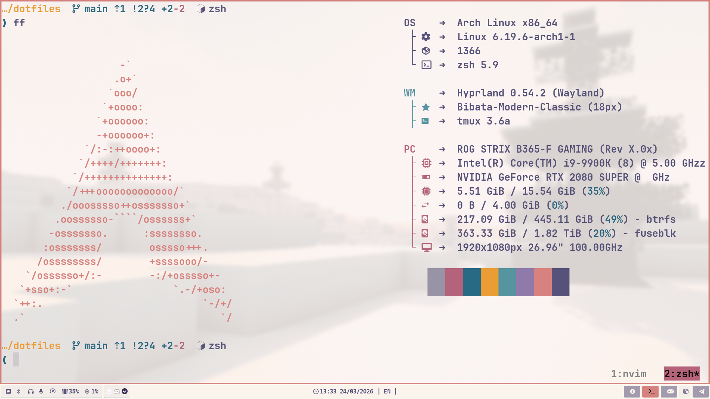

# dotfiles ☕️ 

My personal chaos, carefully organized.  
Arch + [Omarchy](https://omarchy.org/) + Hyprland scrolling layout + a suspiciously cozy terminal.

---



---

## what's inside

| | |
|---|---|
| WM | Hyprland (scrolling) |
| Terminal | Ghostty |
| Shell | Zsh + Starship |
| Multiplexer | tmux |
| Launcher | Walker |
| Bar | Waybar |
| Font | CaskaydiaMono Nerd Font |

---



---

## setup

```bash
git clone https://github.com/kovs713/dotfiles.git ~/dotfiles
cd ~/dotfiles
```

### packages

```bash
sudo pacman -S --needed - < packages/official.txt
yay -S --needed - < packages/aur.txt
```

### symlink everything

```bash 
bash symlinks.sh
```

---

## goodies

`scripts/smart-session.sh` — tmux sessionizer via zoxide + fzf. Jump to any project in ~2 keystrokes.

`keyboard/` — Vial layout for my 42 keys split + udev rules for disabling the internal keyboard when an external one is plugged in.

`packages/` — full package lists.

---
 
## keyboard
 
3 layers. home row mods on `a s d f` / `j k l ;` (Super, Alt, Shift, Ctrl).
 
```
  layer 0 · base
  ┌─────┬─────┬─────┬─────┬─────┬─────┐     ┌─────┬─────┬─────┬─────┬─────┬─────┐
  │ tab │  q  │  w  │  e  │  r  │  t  │     │  y  │  u  │  i  │  o  │  p  │  [  │
  ├─────┼─────┼─────┼─────┼─────┼─────┤     ├─────┼─────┼─────┼─────┼─────┼─────┤
  │ esc │  a  │  s  │  d  │  f  │  g  │     │  h  │  j  │  k  │  l  │  ;  │  '  │
  ├─────┼─────┼─────┼─────┼─────┼─────┤     ├─────┼─────┼─────┼─────┼─────┼─────┤
  │  `  │  z  │  x  │  c  │  v  │  b  │     │  n  │  m  │  ,  │  .  │  /  │  \  │
  └─────┴─────┴─────┴─────┴─────┴─────┘     └─────┴─────┴─────┴─────┴─────┴─────┘
                      ┌─────┬─────┬─────┐ ┌─────┬─────┬─────┐
                      │ mo2 │ mo1 │ spc │ │ ent │ bsp │ del │
                      └─────┴─────┴─────┘ └─────┴─────┴─────┘
 
  layer 1 · sym
  ┌─────┬─────┬─────┬─────┬─────┬─────┐     ┌─────┬─────┬─────┬─────┬─────┬─────┐
  │ tab │  !  │  @  │  #  │  $  │  %  │     │  ^  │  &  │  *  │  (  │  )  │  ]  │
  ├─────┼─────┼─────┼─────┼─────┼─────┤     ├─────┼─────┼─────┼─────┼─────┼─────┤
  │ esc │  1  │  2  │  3  │  4  │  5  │     │  6  │  7  │  8  │  9  │  0  │  \  │
  ├─────┼─────┼─────┼─────┼─────┼─────┤     ├─────┼─────┼─────┼─────┼─────┼─────┤
  │  ~  │  _  │  +  │  -  │  =  │     │     │     │  {  │  }  │  <  │  >  │     │
  └─────┴─────┴─────┴─────┴─────┴─────┘     └─────┴─────┴─────┴─────┴─────┴─────┘
                      ┌─────┬─────┬─────┐ ┌─────┬─────┬─────┐
                      │ mo2 │ mo1 │ spc │ │ ent │ bsp │ del │
                      └─────┴─────┴─────┘ └─────┴─────┴─────┘
 
  layer 2 · nav
  ┌─────┬─────┬─────┬─────┬─────┬─────┐     ┌─────┬─────┬─────┬─────┬─────┬─────┐
  │  f1 │  f2 │  f3 │  f4 │  f5 │  f6 │     │  f7 │  f8 │  f9 │ f10 │ f11 │ f12 │
  ├─────┼─────┼─────┼─────┼─────┼─────┤     ├─────┼─────┼─────┼─────┼─────┼─────┤
  │ br+ │ prt │ mb3 │ mb2 │ mb1 │  wu │     │  ←  │  ↓  │  ↑  │  →  │  v+ │ pgu │
  ├─────┼─────┼─────┼─────┼─────┼─────┤     ├─────┼─────┼─────┼─────┼─────┼─────┤
  │ br- │ mut │  ⏮  │  ⏯  │  ⏭  │  wd │     │  m← │  m↓ │  m↑ │  m→ │  v- │ pgd │
  └─────┴─────┴─────┴─────┴─────┴─────┘     └─────┴─────┴─────┴─────┴─────┴─────┘
                      ┌─────┬─────┬─────┐ ┌─────┬─────┬─────┐
                      │ mo2 │ mo1 │ spc │ │ ent │ bsp │ del │
                      └─────┴─────┴─────┘ └─────┴─────┴─────┘
```

---

> steal whatever, no attribution needed
